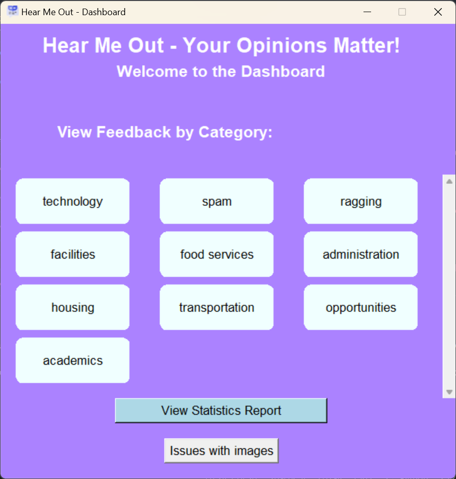

# Hear Me Out- Your Opinions Matter!
"Hear Me Out" is an innovative anonymous messaging platform designed to empower individuals to voice their feedback and concerns about their institution or any other environment where their voices need to be heard. This platform provides users with a safe space to express their thoughts freely, ensuring their anonymity while enabling constructive feedback collection.

The project consists of a comprehensive web interface where users can submit feedback, including text and images, without revealing their identity. On the backend, the platform categorizes feedback, generating insightful summaries for various categories. The system also includes a dashboard that allows administrators to view feedback by category, along with statistical reports that provide sentiment analysis of the submitted feedback.

Designed with scalability in mind, "Hear Me Out" can be easily adapted to various environments beyond institutions, making it a versatile tool for collecting anonymous feedback in any setting. The platform aims to bridge the communication gap between individuals and authorities, fostering a more responsive and accountable environment.

## Key Features:
- ### Anonymous Feedback Submission:
Share your feedback without revealing your identity.Write your feedback in any language, including Hinglish, Benglish, and other multilingual content.
- ### Category-wise Feedback Summary:
Can view feedback summaries categorized by topics.Get insights into specific areas of concern or praise.
- ### Statistics Report:
Generate comprehensive statistics reports to understand feedback trends.Visual representations of feedback data to help identify key issues and areas for improvement.
- ### Image Uploads:
Attach images to your feedback to provide additional context.
Images, along with messages and categories, are displayed in the dashboard.
- ### Interactive Dashboard:
Access to a user-friendly dashboard.
View summaries of feedback with options to drill down into specific categories.
- ### Scalability:
'Hear Me Out' is not just for institutions; it's scalable and adaptable for any place or organization seeking anonymous feedback.
Whether it's a company, community, or public service, our platform can accommodate diverse feedback needs.

## How it works:
1. ### Submit Feedback:
Visit our feedback submission page.
Drop in your message, thoughts, opinions.
Optionally, upload an image to support your feedback.
'Hold to Send' and your feedback will be anonymously sent to the relevant organization.

2. ### View Feedback:
Organizations can access their dashboard.
Browse through categorized feedback summaries.
Analyze feedback trends using the statistics report.

## Project Images:





## Libraries to be installed:
```bash
pip install tkinter matplotlib pillow flask flask-sqlalchemy pandas scikit-learn transformers torch
```
## Handling Errors:
There might be pyTorch and numpy related errors from system to system. In that case run the following code,
```bash
pip uninstall torch numpy
pip install torch==2.2 numpy<2
```

